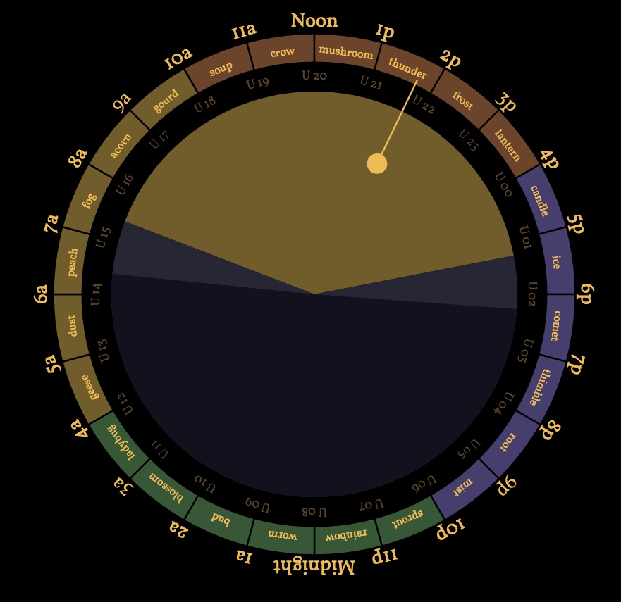

# Seasonal Hours Clock

It would be nice if the 24 hours of UTC time each had a short memorable name.  It would make it easier to plan chats with distant friends, since the hour-names would be synchronized around the world.

Let's choose a theme like... seasons of the year, just to be confusing. :)  UTC 00 is the beginning of winter, UTC 12 is the beginning of summer.  The name of UTC 00 is **The Candle Hour** because it feels wintery.

This repo is a simple website that draws a 24-hour clock showing your local time, the seasonal hour name, and the UTC hour.

Local noon is at the top and local midnight at the bottom.

The 4 seasons each have their own color, and the "year" starts at UTC 00.  Winter is blue, spring is green, etc.

The faint innter text is the hour in UTC.  In this screenshot it's 1:45pm local time, UTC 21, the Hour Of Thunder.

The colored pie chart in the middle shows daylight, dusk, and night.  The hour hand also represents the sun.

[seasonal-hours.ts](https://github.com/cinnamon-bun/seasonal-hours-clock/blob/main/src/seasonal-hours.ts) has a complete listing of hour names.

This concept originated in [Twodays Crossing](https://github.com/earthstar-project/twodays-crossing), an Earthstar chat app.

[View in CodeSandbox](https://codesandbox.io/s/old-hooks-2cxi6?file=/README.md)

