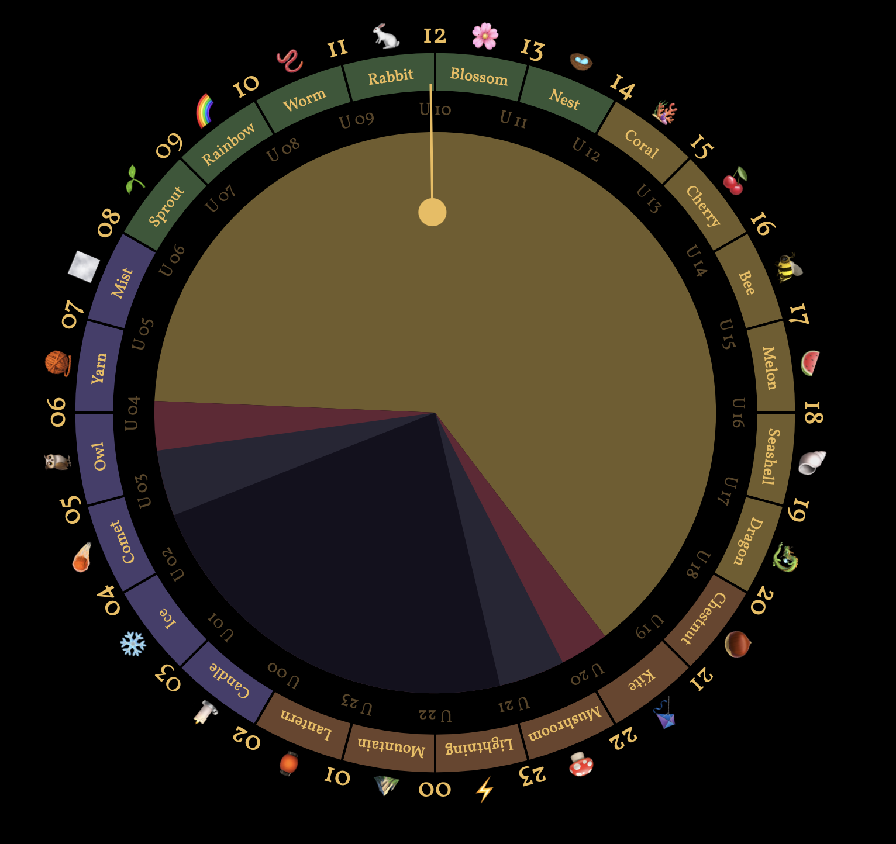

# Seasonal Hours Clock

[See it live](https://seasonalclock.org)

It would be nice if the 24 hours of UTC time each had a short memorable name. It
would make it easier to plan chats with distant friends, since the hour-names
would be synchronized around the world.

Let's choose a theme like... seasons of the year, just to be confusing. :)
Squish a year into 24 hours starting with the winter solstice at UTC 00, which
we'll call **The Candle Hour**.

This repo is a simple website that draws a 24-hour clock showing your local
time, the seasonal hour name, and the UTC hour.

Outer numbers: local time, with noon at top and midnight at bottom.

Faint inner numbers: UTC time.

Colorful ring: the seasonal name of each hour. Winter is blue, spring is green,
summer is yellow, autumn is orange.

The colored pie chart in the middle shows sunset times: daylight, dusk, and
night. The hour hand is the sun traveling across the sky.

You can highlight certain hours by adding search parameters of the form `hl=<integer>` or `hl=<hour name>` to the url, for example [`https://seasonalclock.org/?hl=6&h=rainbow`](https://seasonalclock.org/?hl=6&h=rainbow) to highlight sprout hour (UTC+6) and rainbow hour.

You can specify a latitude and longitude in the url that is used for displaying sun hours, by adding search parameters of the form `lat=<float>` and `lon=<float>` to the url (both have to be present), for example [`https://seasonalclock.org/?lat=52.31&lon=13.24`](https://seasonalclock.org/?lat=52.31&lon=13.24).

You can specify an offset from utc in the url to override the time displayed in the outer circle, by adding a parameter `offset=<float>` to the url, for example [`https://seasonalclock.org/?offset=5`](https://seasonalclock.org/?offset=5). Combine this with setting latitude and longitude to create links that show local time and sun hours for arbitrary locations:

- Berlin in summer (latitude 52.31 degrees, longitude 13.24 degrees, UTC+2): [`https://seasonalclock.org/?lat=52.31&lon=13.24&offset=2`](https://seasonalclock.org/?lat=52.31&lon=13.24&offset=2)
- Wellington (latitude 41.17 degrees, longitude 174.46 degrees, UTC+12): [`https://seasonalclock.org/?lat=41.17&lon=174.46&offset=12`](https://seasonalclock.org/?lat=41.17&lon=174.46&offset=12)

---

[seasonal-hours.ts](https://github.com/sgwilym/seasonal-hours-clock/blob/main/src/seasonal-hours.ts)
has a complete listing of hour names.

This concept originated in
[Twodays Crossing](https://github.com/earthstar-project/twodays-crossing), an
Earthstar chat app.

This clock was created by @cinnamon-bun. We miss you.
